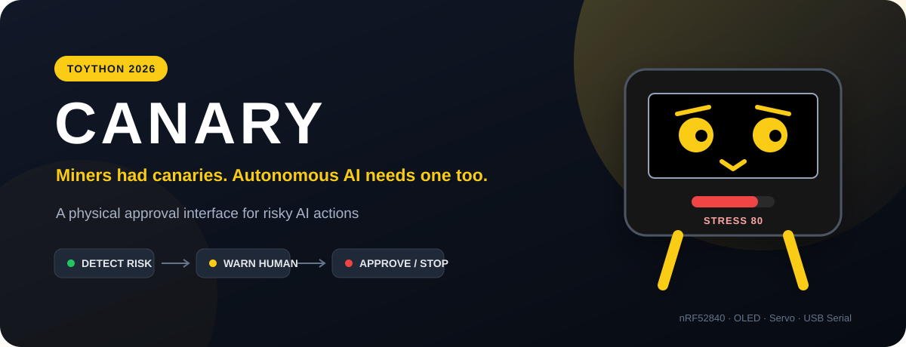
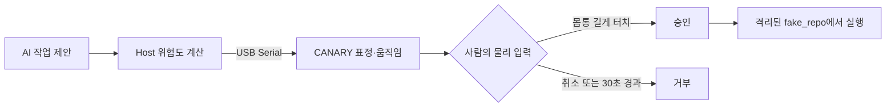
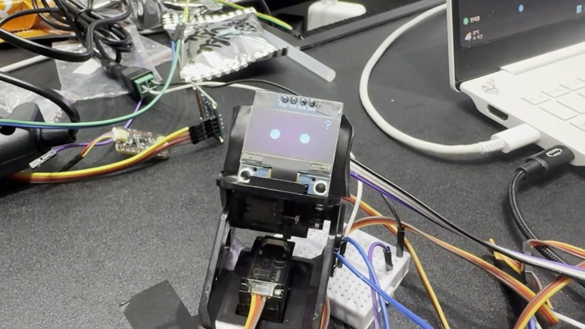

<div align="center">



# CANARY

**Miners had canaries. Autonomous AI needs one too.**

위험한 AI 행동을 표정과 움직임으로 알리고, 사람이 물리적으로 승인하거나 중단하는 인터페이스 프로토타입

[](#프로젝트-상태)
[](#프로젝트-개요)
[](#하드웨어-준비)
[](LICENSE)

### [▶ 하드웨어 없이 시뮬레이터 체험하기](https://taehuni.github.io/Canary/)

</div>

---

## 프로젝트 개요

CANARY는 자율 AI 에이전트가 파일 삭제처럼 위험할 수 있는 작업을 제안했을 때, 작은 로봇이 OLED 표정과 서보 움직임으로 위험도를 전달하는 해커톤 프로토타입입니다. 높은 위험도의 작업은 몸통을 길게 터치해야 승인되며, 응답이 없으면 30초 후 거부됩니다.

TOYTHON 2026에서 **NU-40 DK(nRF52840), 128×64 OLED, 터치 센서, 서보 모터**를 사용해 제한된 시간 안에 아이디어를 시연하는 데 초점을 맞췄습니다. 실제 AI 서비스에 연결된 완성형 보안 제품이 아니라, 사람이 AI의 행동을 물리적으로 확인하는 상호작용을 실험한 결과물입니다.



## 실제 하드웨어 시연

[](https://taehuni.github.io/Canary/media/canary-hardware-demo.mp4)

**[▶ CANARY 하드웨어 시연 영상 보기 (29초)](https://taehuni.github.io/Canary/media/canary-hardware-demo.mp4)**

웹 화면에서 작업을 제안하고, 위험도에 따라 실제 장치의 OLED 표정이 달라지는 과정을 촬영한 영상입니다. 브라우저 호환성을 위해 원본 영상을 H.264 형식으로 변환했습니다.

## 프로젝트 상태

> **Status: Hackathon Prototype / Archived**
>
> 핵심 표정 표현, 시리얼 통신, 터치 승인 흐름과 웹 시뮬레이터까지 구현한 데모입니다. 일부 센서 입력은 호스트의 처리 로직만 작성되어 있고 펌웨어에는 연결되지 않았습니다. 현재 배포 목적의 서비스로 운영하고 있지는 않습니다.

### 구현됨

- 위험도에 따른 `CALM`, `ALERT`, `TENSE`, `ALARM` 표정과 OLED 애니메이션
- USB Serial을 통한 스트레스·표정·제스처 명령 전달
- 머리 터치 이벤트와 몸통 길게 터치하는 물리 승인 입력
- 서보 기반 `tilt`, `recoil`, `shake`, `bow` 제스처
- 30초 동안 승인되지 않으면 거부하는 호스트 타임아웃
- 삭제 데모를 `host/fake_repo/` 내부로 제한하는 경로 검사
- 128×64 OLED 표현을 브라우저에서 확인하는 무설치 시뮬레이터

### 일부 구현됨

- 호스트 컨트롤러는 제안된 작업을 규칙 기반으로 평가하는 데모이며, 실제 AI 에이전트와 직접 연동되지는 않음
- 시뮬레이터는 주요 표정 파라미터를 재현하지만 실제 보드의 모든 입력·동작을 대신하지는 않음
- 보드 핀과 시리얼 포트는 환경에 맞게 소스에서 직접 조정해야 함

### 기획 또는 미연결

- IMU 흔들기·뒤집기 입력: 호스트 이벤트 처리 로직은 있으나 현재 펌웨어에서 이벤트를 생성하지 않음
- 로터리 입력을 통한 자율성 조정: 프로토콜과 호스트 처리만 있고 현재 펌웨어 입력은 연결되지 않음
- 실제 파일·셸 작업을 수행하는 범용 에이전트 연동

## 동작 흐름

| 위험도 | 단계 | CANARY 반응 | 데모 정책 |
|---:|---|---|---|
| 0–24 | `CALM` | 평온한 표정 | 즉시 허용 |
| 25–54 | `ALERT` | 실눈으로 주의 표시 | 자율성 설정에 따라 허용 |
| 55–79 | `TENSE` | 커진 눈으로 경고 | 이유 확인 대상 |
| 80–100 | `ALARM` | 큰 눈·눈썹·반동 | 몸통 길게 터치해야 승인 |

호스트 데모에서는 읽기, 수정, 삭제, 셸 실행 등 작업 종류와 삭제 파일 수를 기준으로 위험도를 계산합니다. 이 점수 체계는 보안 모델이 아니라 상호작용 시연을 위한 단순 규칙입니다.

## 빠른 시작

### 웹 시뮬레이터

[배포된 시뮬레이터](https://taehuni.github.io/Canary/)를 열거나 `sim/index.html`을 브라우저에서 직접 실행합니다. 별도의 서버나 빌드 과정은 필요하지 않습니다.

슬라이더로 위험도를 변경하고 강제 표정, 눈 깜빡임, 미세 떨림, 놀람 애니메이션을 확인할 수 있습니다. 화면 아래에서는 현재 파라미터를 반영한 Arduino 코드 조각도 생성합니다.

### 하드웨어 준비

1. Arduino IDE의 추가 보드 매니저 URL에 아래 주소를 등록합니다.

   ```text
   https://raw.githubusercontent.com/Nucode01/Adafruit_nRF52_Arduino/refs/heads/master/package_nuduino_index.json
   ```

2. 보드 매니저에서 `NUCODE`를 검색해 **NUBoards nRF52 v1.0.1 이상**을 설치합니다.
3. **NUBoards nRF52 → NU40DK nRF52840** 보드를 선택합니다.
4. `Adafruit GFX Library`, `Adafruit SSD1306` 라이브러리를 설치합니다.
5. `firmware/canary_firmware.ino`의 핀 설정을 실제 배선에 맞춘 뒤 업로드합니다.

포트가 보이지 않으면 RESET 버튼을 빠르게 두 번 눌러 부트로더 모드로 진입합니다.

### 호스트 컨트롤러

```bash
pip3 install pyserial
ls /dev/tty.usbmodem*       # 연결된 포트 확인
# host/controller.py 상단 PORT 값을 수정
python3 host/controller.py
```

실행 후 키보드로 데모 제안을 만들 수 있습니다.

| 입력 | 동작 |
|---|---|
| `a` | 안전한 읽기 작업 제안 |
| `b` | 14개 파일 삭제 작업 제안 |
| `p` | 현재 상태 출력 |
| `r` | `fake_repo` 초기화 |
| `q` | 종료 |

## 시리얼 프로토콜

USB Serial, 115200 baud, 개행 단위의 텍스트 프로토콜을 사용합니다.

### 호스트 → 보드

| 명령 | 예시 | 상태 |
|---|---|---|
| `STRESS <0-100>` | `STRESS 80` | 구현됨 |
| `FACE <name>` | `FACE alarm` | 구현됨 |
| `GESTURE <name>` | `GESTURE recoil` | 구현됨 |
| `PING` | `PING` | 구현됨 |

`FACE`: `calm | alert | tense | alarm | locked`<br>
`GESTURE`: `center | tilt | recoil | shake | bow`

### 보드 → 호스트

| 이벤트 | 의미 | 현재 상태 |
|---|---|---|
| `EVT TOUCH_HEAD` | 머리 터치 | 펌웨어 연결됨 |
| `EVT TOUCH_BODY` | 몸통 짧게 터치 | 펌웨어 연결됨 |
| `EVT TOUCH_BODY_LONG` | 몸통 길게 터치·승인 | 펌웨어 연결됨 |
| `EVT SHAKE <value>` | 흔들어서 취소 | 호스트 처리만 구현 |
| `EVT FLIP` | 뒤집기 | 호스트 처리만 구현 |
| `EVT ROTARY <0-100>` | 자율성 변경 | 호스트 처리만 구현 |
| `READY` / `PONG` | 연결 상태 확인 | 구현됨 |

## 프로젝트 구조

```text
canary/
├── .github/workflows/pages.yml    # GitHub Pages 배포
├── firmware/
│   └── canary_firmware.ino        # OLED, 터치, 서보, 시리얼 펌웨어
├── host/
│   ├── controller.py              # 위험도 평가와 승인 흐름 데모
│   └── fake_repo_seed/             # 안전한 삭제 시연용 데이터
├── sim/
│   ├── index.html
│   ├── params.js                  # 표정 파라미터
│   ├── sim.js                     # OLED 렌더링과 코드 생성
│   └── style.css
└── AGENTS.md                      # 개발·동기화 규칙
```

## 파라미터 동기화

표정 관련 값은 아래 세 위치에서 같은 값을 유지해야 합니다.

1. `sim/params.js`의 `PARAMS`
2. `firmware/canary_firmware.ino` 상단의 `PARAMS` 블록
3. `sim/sim.js`의 `generateCode()` 출력 문자열

한 곳만 수정하면 시뮬레이터, 생성 코드, 실제 OLED 결과가 달라질 수 있습니다.

## 안전 범위와 한계

- 현재 호스트 코드는 일반 셸을 직접 제공하지 않고 정해진 데모 제안만 처리합니다.
- 삭제 동작은 `host/fake_repo/` 내부에서만 수행하며 `realpath` 경계를 검사합니다.
- 높은 위험도의 동작은 몸통을 길게 터치해야 실행되고, 30초 동안 입력이 없으면 거부됩니다.
- 이 장치는 검증된 보안 장비가 아닙니다. 프로덕션 환경의 권한 통제나 감사 시스템을 대체하지 않습니다.

## 회고

짧은 해커톤 안에서 하드웨어 입력, OLED 표현, 호스트 프로그램, 웹 시뮬레이터를 하나의 흐름으로 연결해 보며 물리 인터페이스가 AI의 추상적인 위험도를 어떻게 전달할 수 있는지 실험했습니다.

다만 시연 범위를 빠르게 완성하는 데 집중하면서 센서 입력 전체를 펌웨어에 연결하지 못했고, 핀·포트 설정도 환경별 구성으로 분리하지 못했습니다. 위험도 계산 역시 고정 규칙이라 실제 작업 맥락이나 권한을 충분히 반영하지 않습니다. 이후 확장한다면 센서 이벤트를 먼저 완성하고, 하드웨어 설정을 분리한 뒤, 실제 에이전트와의 연결은 최소 권한 도구와 감사 로그를 전제로 설계해야 합니다.

## 팀

TOYTHON 2026 서울 AI 허브 피지컬 AI 해커톤에서 시작한 팀 프로젝트입니다.

- 민태훈
- 박태영
- 신종목

Git 기록만으로 개인별 담당 범위를 명확히 확인하기 어려워 역할을 별도로 표기하지 않았습니다.

## 라이선스

MIT License — 자세한 내용은 [LICENSE](LICENSE)를 참고하세요.
